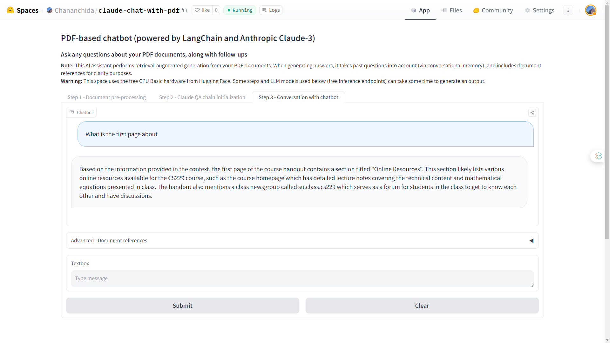

# GenAI-projects

## Claude 3 - Chat with your PDF

Ask any questions about your PDF documents, along with follow-ups

Source code: https://github.com/Parncncd/GenAI-projects/blob/main/claude_chat_with_pdf.ipynb

Demo: https://huggingface.co/spaces/Chananchida/claude-chat-with-pdf

## Claude 3 - Basic RAG

Source code: https://github.com/Parncncd/GenAI-projects/blob/main/claude_QA_RAG.ipynb

## Fine-Tuning Llama2 with Medical Terms Dataset

Source code: https://github.com/Parncncd/GenAI-projects/blob/main/Fine_Tuning_Llama_2_with_Medical_Dataset.ipynb
